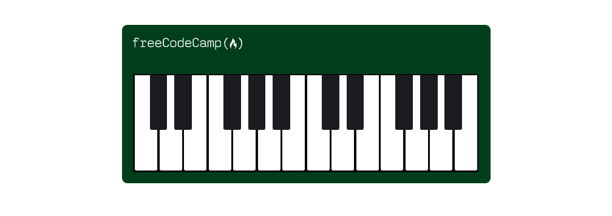
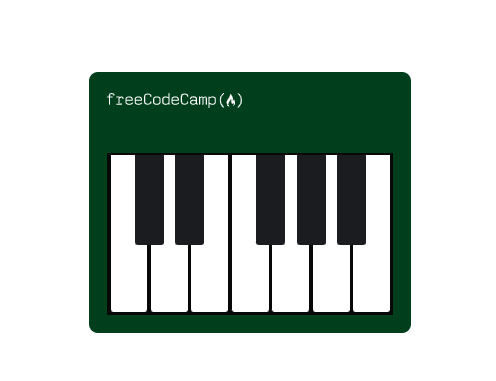

# Responsive Piano

This project showcases responsive web design by building a piano that responds to changes in screen width.  Depending on the size of screen you are viewing this web page on, the size of the piano will adjust accordingly.

## Preview

Deployed via Github [Pages](https://katepatch.github.io/Responsive-Piano/)

## Screenshot

 
Desktop 

 
Tablet 

 
Mobile

## Questions

For questions regarding this project or any others I can be reached via: 
Github: [katepatch](https://github.com/katepatch) 
Email: kate.epatch@gmail.com
